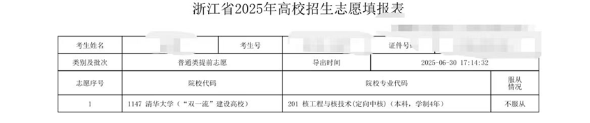
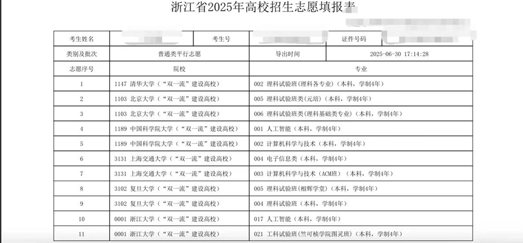
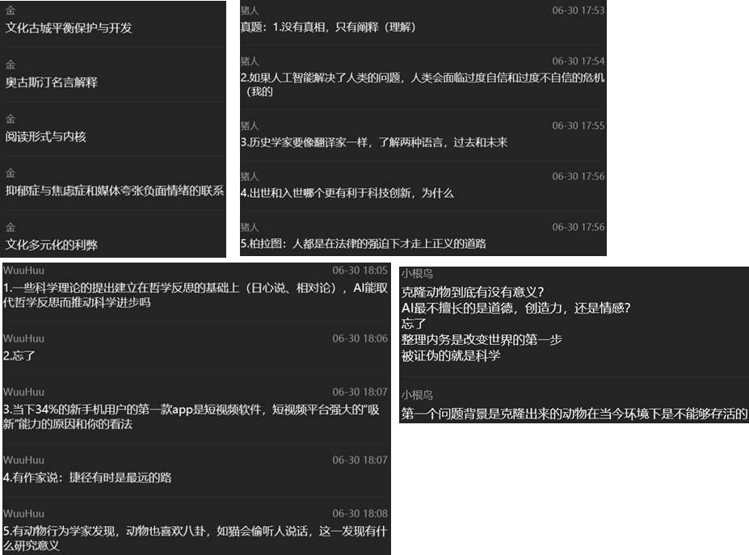

高考700分位101最后强基录取（不是第一志愿物理I，可见选物理I的都是什么变

## **关于培训（2025清大培优）**
个人感觉最有用的部分在于每天晚上的模拟/真题卷+讲评，对于我这种自制力差的人来说很好地保持了高考后继续解题的手感。

但白天的讲解委实一言难尽。数学讲的知识点褚老师都曾经在强基/竞赛辅导中讲到过，我们其实更希望听到这些方法如何自然的运用到看起来抽象的题目中去，而不是听一遍（因为老师字太丑看不懂）答案，最后草草了事；物理可能因为时间太短而显得过于仓促，很多式子没有深入展开而（可能对于没学过物竞的同学）欠熟练度；化学讲的还可以，但同样因为时间太短而有机只触到皮毛，完全没有够到考试难度（但也确实很难想到今年化学能出这么难）；还有面试，老师希望我们投入大量时间准备自我介绍以及相关经历，结果前面的同学出来说根本没有个人问->后面的同学：？

总结：引用韩奇晔学长在下面写的一句话，“个人认为强基之前在慈溪中学的培训收效甚微，有种高考后继续蹲大牢的绝望感，希望不要因此而影响心态。”有条件的话建议还是自己找老师开展小班化教学，一来避免老师良莠不齐，二来避免老师讲解内容大众而重复。

## **关于出分**
先上结论：清北老师没有来找你说“可以签字了”就要专心准备强基，无论他们怎么说“概率很大”，都是空头支票，随时都可能出现变局。

2025.06.25 15:00左右出分，当时我就和两个裸分录取的同学（位64&69）被叫到行政楼讨论志愿相关问题，我是第一个确定志愿的（巧了也是工科试验班），然后PKU老师就告诉我说“现在的情况你录取的概率很大，你稍微等我们排查完毕就可以签了”，然后当天就等到了23:00才空手离开学校（甚至中间还和老师、赵校和两个大神吃了顿晚饭）（甚至top64已经签掉了）。

2025.06.26我想：“要不去学校边复习强基边等吧”，只等来了“情况很复杂，还在排查，但你是很大概率没问题的”的回复和top69已经签掉的消息。

2025.06.27 我想：“要不去学校边复习强基边等吧”，结果被另一位PKU老师猛猛安利北医的好处，其实我当时心里已经有疑心了，但这种吊着的状态非常打乱我的强基复习节奏（非常明显的一点就是我必须时刻查看手机的新信息，万一就是“你可以来签字”了呢）。

2025.06.28 去北京，彻底死心，决定将清华核物理定向培养提前批作为保底冲击强基。

2025.06.29-2025.07.01 强基考试，期间因为PKU与THU都态度模糊，故志愿填报如下：（现在想来真是最正确的决定）

总结：清北老师为了将你招到自己大学会不遗余力（esp. PKU，我打电话问THU的时候他们用5秒钟告诉了我PKU5天闪烁其词的真相：“我们能帮你争取录取后的专业，但我们不保证你能被我们裸分录取”），但各位还要擦亮眼睛，看穿模糊言辞后的不确定，打定“没签就是没进”的决心坚定准备强基。

小趣事：2025.06.25-2025.06.30共与鲁校通电话12个（再次感谢鲁校为我的录取/强基想尽各种办法甚至亲临北京）、与PKU老师通电话6个并面谈一次，与THU老师通电话4个

<u>以下关于强基考试的内容均为PKU理科改为考察数理化的首年情况，时效性可能较强，请后来同学谨慎吸收</u>

## **关于笔试**
不允许带尺规！不允许带尺规！！不允许带尺规！！！（只允许带黑笔、铅笔、涂卡笔、橡皮）（所以不要想着数学不会的几何精准作图得出答案）（好像也没考这种题？）

大体形式：数学20题单选*5pts；物理20题不定项（漏选得2分）*5pts；化学50题不定项（漏选不得分）*2pts，每科限时1h，到时间会收走上一门试卷并发下下一门（小技巧：可以把最后还没做出来的题目抄在草稿纸上变相延长考试时间）（答题卡是共用的）

数学：体感比23、24两届都要简单，个人蒙了5道（本来就弱数学）

物理：不难，懂一些基本概念并加以运用即可

化学：难  爆  了。组成大致为10道元素+25道有机+15道原理，元素原理尚有一战之力，但有机从题目到选项都看不懂怎么办:(

总结：竞赛背景在强基中会显得尤为重要，对于高一高二的同学来说在空闲时间内加以拓展还是能帮上很大忙的。但钻研的时候要深入探究以加强记忆不然像我退役大半年什么都不记得了就不好了

## **关于面试**
大体形式：每天分场次进行（一小时一场），进场后按照提前排定的顺序分组（5人/组），每组同时被带到对应的房间进行面试（内坐3个教授），每人抽一个问题进行2min思考（提供笔纸），然后举手决定回答顺序，在每人回答至多4min时间后展开自由补充，可以举手补充任意同学（包括自己）的题目并进一步讨论。如果冷场教授会挑一个问题挨个问过来（冷场的多就多挑几个）

考前等待时可以与同组同学唠嗑来建立连结，这样等待时间不会过于尴尬且发言时能够更加自然

抽到问题后动用作文审题的方法进行审题，利用2min时间抓紧列出发言提纲，如果实在没有列完可以考虑在别的同学发言的时候继续思考（有风险）

自由补充环节反应时间非常紧张，一个人说完话就到了补充环节，要敏锐捕捉对方话语中有问题的地方（友善提出并探讨）或可以深入的地方加以展开

很难做到每句话都有道理而通顺，对某个议题有深刻思想自然可以慢慢展开，而若遇到没啥想法的题目可以通过举例子混过去（怎么像作文混分呢）

部分面试题选：

总结：纯粹的考察学生思想深度与逻辑能力，追求真理，想好再说（“想好”指至少有点子可以说）
## **关于清华提前批**

据我了解的情况：会降1-7分，可以保研，可以读博，但无论如何毕业之后都要在中核集团下属企业工作5年（“签卖身契”），如果拒绝需缴纳巨额违约金并扣留学位证书与毕业证书5年（即这五年查不到你的大学学历）

优点自然在于包就业（还能直接就业国企），升迁也快；但缺点同样在于包就业，有一种未来十几年的人生轨迹被框定的感觉，如果没有坚定的信念很容易陷入迷茫

总结：个人建议是如果不对核工程这方面非常感兴趣还是不要只为了一个清北的牌子报清华提前批，毕竟5年卖身契不是谁都签的起的（但如果像我这种非常喜欢核物理的当然建议报考）（既上了清华又在从事自己喜欢的事业岂不美哉）
## **碎碎念**

裸分非常非常重要，作为2025YYHS强基力学三人组中笔试分数最低的人，我可以说我就是靠高考分数混进强基线的（笑）（当然各位要是裸分直接过线了就更好了）（哭

三一：不懂，当初嫌报名手续太麻烦就没报，但鉴于强基并不高的通过率（2025:4/9）建议还是先报着并参加笔试（培训真没什么好听的不如去刷刷别家的真题），等到高考结束之后如估出超高分（如估分700+）再考虑放弃面试，不然就会两头落空

平时还是要PKU与THU两头联系（直接找他们的招生老师），不要偏听偏信然后就被一边忽悠跑了

## **联系方式**
Tel:18968294969 Mail:Hoshimimiyabi189@outlook.com

WeChat:WuHu18968294969 QQ:3212363343 