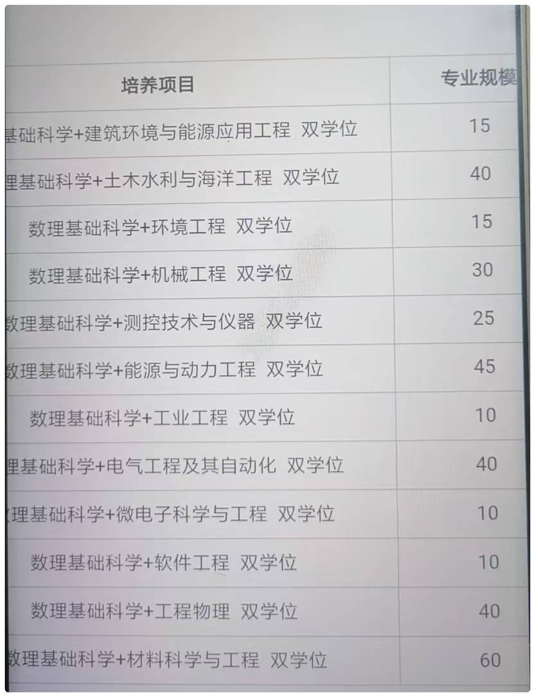

选考物化生 高考701 省排128

A+政策

笔试 9.26/10

面试 5/5

校测总分 14.26/15

综合成绩 93.71/100

## **清华强基**

高考85，校测总分15，笔试10+面试5，政策体现在笔试小作文，理科笔试满分400，其中数学100，物理60，化学40，小作文200，笔试成绩会淘汰一部分人。23届浙江省理科类综合成绩录取分数线为92.23分。感觉浙江省的分数线虚高，后续会有一个换算，所以和其他省相比反而有点小劣势。

未央书院全部为双学位，数理基础科学是定的，另有12个工科衔接方向，分别是软件工程、材料科学与工程、工程物理、微电子科学与工程、电气工程及其自动化、工业工程、能源与动力工程、测控技术与仪器、机械工程、环境工程、土木水利与海洋工程、建筑环境与能源应用工程，强基报名时是平行志愿，但后续选择工科衔接方向时志愿优先，即有一二三志愿之分。

## **个人建议**
### **备考**
我本人报了复旦的三位一体，但是笔试就没有参加，所以三一备考没什么经验，主要还是说说选择问题。当时三一的笔试和高考挨的很近，我考完身心俱疲，完全没有学习状态，再加上自己觉得高考考得不错，所以就没去笔试。但是我这是属于过早把退路掐断了，建议大家如果不是特别有把握裸分上，还是要去考三一的笔试的，毕竟之后还可以决定是否参加面试，给自己留一条退路（当然最终还是要做出决定的）。我还一度不想去参加清华的强基，想着直接裸分上北大的医学专业，现在看来是非常愚蠢的想法。这里提醒大家一定不要对学校有什么偏见，高中时期听到的一些传闻未必是真的，高考的偶然性还是挺大的，所以在高考没有很大把握的情况下，双保险（裸分+强基/三一+强基）肯定是利大于弊的。

强基笔试数学为不定项，难度不会超过竞赛，个人感觉数竞选手没有很大优势，还是物竞和化竞选手稍稍占优。考前一定要制定好策略，包括时间分配和拿分方案。我本人是先按顺序做下来，其中数学不会的先空着，物理化学不会的就直接蒙一个（因为物竞化竞水平不足，不会就是不会），然后剩余时间就回过头去做数学。所有题都是宁可少选不可错选。

面试准备还是要多模拟吧。面试当天一定要吃早饭！有可能7点进去12点才轮到。面试形式是先给你半个小时阅读文章，并附带着准备文章后的两个问题（有铅笔和白纸），然后去面试教室，老师会先问那两个问题，之后再问其他问题。不要小看面试，<u>虽然有人说面试有调分的作用，但是我有个同专业同学5分里面只拿了0.7分的。</u>

### **书院**

未央书院有点卷，均绩很高。

未央书院专业听名字是“数理”，实际上主要学物理。

lyy补档：绝大多数报考未央书院的同学都是冲着软件工程，微电子去的，但是这几个专业占整个书院比例小（此处手动@脑王补充一下比例），因此竞争压力大，慎选。

未央书院一届共招收340人左右，每个专业的录取人数见下图。由于选择工科衔接方向时志愿优先，很多人都会求稳避免“滑档”。现在回过头来分析三字班的录取情况，其实软件工程和微电子的最后一名的百分比都位于40%-50%之间，并没有大家想象的那么高，这是大家的“求稳”心态导致的，同时一些不那么热门的专业也有前10%的同学选择。所以如果大家如果有特别喜欢的专业（微电子、软件、电气）除外，可以直接放在第一志愿，但微电子、软件不放在第一志愿肯定是选不上的，只推荐排名30%以内的考虑。

{: width="50%"}

### **其他**

北京的气候不是很好，要做好心里准备。

清华的军训有三周，很累！

如果不会骑自行车，假期赶紧学。
（毕竟T是P的五倍，P又输——贵校鼠鼠）

## **联系方式**

QQ：1819562594

微信：lyb13958367116