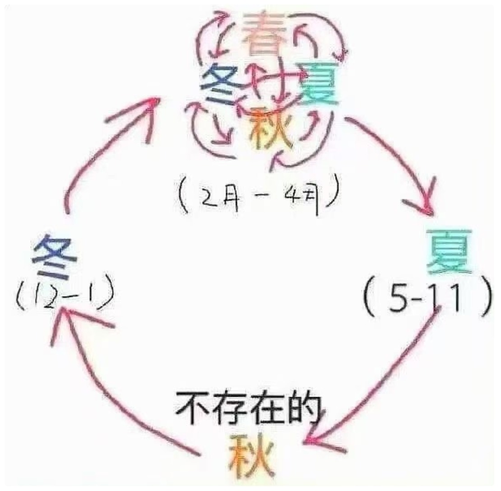

选考物化技，高考705，省排61

### 清华强基
理科强基计划主要是笔试（200作文+200考试数理化）+面试，A+可以直接笔试作文部分180-200分，面试会用来调分，如果有A+则面试分数会相对较低

清华大学强基计划主要设立五大书院，其中行健书院的专业是是钱学森力学班（授予理学学位，专业为理论与应用力学）或者理论与应用力学+航空航天工程/车辆工程/能源与动力工程/土木水利与海洋工程（授予工学学位，专业就是一张证书上的双学位）

行健书院在原有专业基础上，本年度将会推出交叉工程学位，不单独设班，采用报考方式，具体情况暂时无官方文档

**虽然行健书院学的是力学，但是大一数学难度与数学系基本一致**

### 个人建议

**听校领导的，听校领导的，听校领导的！！！**

如果认为校领导说得不好，那么如果不是对基础学科有切实兴趣，我不推荐报考任何强基或者三一招生（除了浙大三一，如果认为裸分上浙大比较困难的话），尤其是强基计划，**专业分配过程中“滑档”会导致分配专业出现严重问题，且不允许转专业。**在清华强基中，被录取到某一书院后采用录取方式为志愿优先，也就是先录取所有人第一志愿再看第二志愿，所以即便你排名前30%，但是你所选择的第一志愿已经录取满，且排名靠后同学把你的第二志愿作为第一志愿，那么你还是比他们后录取。

请大家务必注意，从排名和专业角度而言，浙江大学的实力不容小觑，工科（尤其是热门工科）几乎不逊色于清华大学。因此如果没有名校执念，浙大是非常合适的选择。（而且离家近，同学多，气候宜人，水产丰富）（北京真不是人住的地方，春天沙尘暴，夏天40度，秋天几乎没有，冬天零下10度）

{: width="70%"}

👆配图来自贵校鼠鼠

不过从另一个角度而言，其实不需要把专业的重要性想象得过高。多数人对专业的接受度其实是非常高的，我最近恰好在做这方面的调研，其实所谓入学时对专业的喜爱或者排斥，在经历了大学四年的学习之后并不会决定你前往某个专业。相反，在一个学院中碰到的老师、同学，每个人的性格特质和学习方法、自己入学时被分到的专业等因素可能对未来专业选择有更大的影响。

### 一些对比

清北强基的一个比较大的差异在于，清华强化了强基计划的存在形式，通过设立书院和双学位把强基计划和普通招生的学生搞得泾渭分明（虽然在我看来强基计划学生的总体质量要比本专业大类招生更高一些），在管理上走不同的路线（好像是因为清华想全面改组书院，因此拿强基试水）
但是北大整体缩小了强基和大类的差异，对二者没有进行明显区分
北大：暂时不能给你明确的答复
实际保研过程中北大文科强基据说也有比较多的限制，建议找北大的学长学姐问问

### 联系方式
QQ：337424605